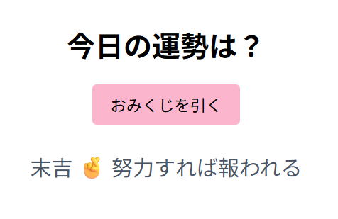

# おみくじアプリ 🎴

シンプルなおみくじを引けるWebアプリです。  
GitHub Pagesで公開しています 👉 [ここをクリック](https://masago432.github.io/omikuji-app/)

## スクリーンショット

## 使い方
1. ページを開く
2. 「おみくじを引く」をクリック
3. ランダムで運勢が表示されます！

## ファイル構成
- index.html
- script.js

## 作者
masago（[@masago432](https://github.com/masago432)）
